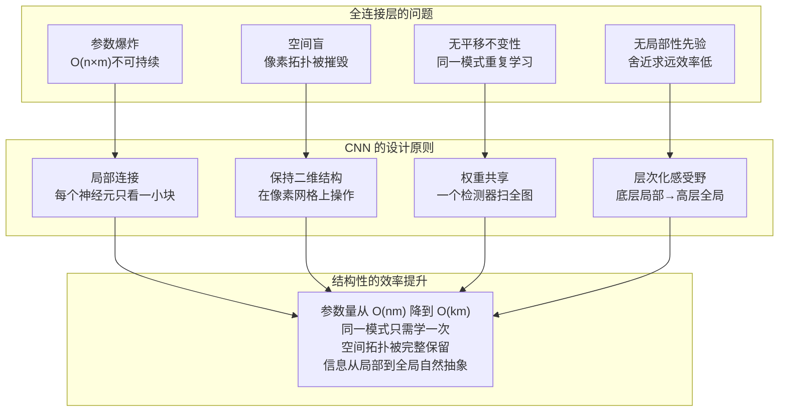

### 四、全连接网络的局限——为什么要进化

**前三章搭好了一套完整的训练体系，但地基上有一道裂缝。**

* 第一章到第三章，我们建起了一座看似完备的大厦：前向传播定义了网络如何从输入算出输出，反向传播高效地算出了所有参数的梯度，优化器和学习率调度让训练稳定收敛，损失函数精确地定义了"什么是好"。用这三章的工具，你可以搭建一个全连接网络、在 GPU 上训练它、看着损失值稳步下降。

* 但有一个问题从第一章第 3 节就埋下了——全连接层的"连接一切"策略。当时我们把它当作最自然的设计：在不知道哪些神经元该合作的前提下，把所有可能的连接都建立起来，让数据自己决定。这个策略在逻辑上自洽——"不做任何预设，每对连接都给一个可调的权重旋钮"。

* 然而，"逻辑自洽"和"工程可行"之间隔着巨大的鸿沟。第一章只是顺带提了一句"30 亿参数、12 GB 显存"，然后就转向了其他话题。这一章要做的，是把全连接层的系统性缺陷全部摊开，逐一分析——不只是"参数量太大"这个最表面的症状，而是更底层的结构性问题：它从根本上违背了图像等结构化数据的本质属性。

* 只有真正理解了全连接层为什么不行，才能理解为什么卷积——以及更广义的"将先验知识编码进网络结构"这一设计哲学——是深度学习从理论走向实践的必经之路。

---

#### 4.1 参数爆炸：一笔算不清的账

* 第一章第 3 节举了一个数字：输入 300 万像素 → 第一隐藏层 1024 个神经元 → $3{,}000{,}000 \times 1024 \approx 30$ 亿个权重。这个数字很大，但当时只是作为一句话带过。现在来把它展开——30 亿个权重在工程上到底意味着什么。

##### 不只是"30 亿个数字"——显存账本逐项算

* 训练一个神经网络时，GPU 显存中需要同时驻留三类数据：**权重本身**、**梯度**、**优化器状态**。以下以全连接层第一层（300 万 → 1024）为例，逐项计算：

**1. 权重矩阵** $\mathbf{W}$（$3{,}000{,}000 \times 1024$）：
$$3{,}000{,}000 \times 1024 \times 4 \text{ bytes (FP32)} = 12{,}288{,}000{,}000 \text{ bytes} \approx \mathbf{11.4 \text{ GB}}$$

**2. 梯度矩阵** $\frac{\partial L}{\partial \mathbf{W}}$（与权重同形状）：
$$\mathbf{11.4 \text{ GB}}$$

**3. 偏置** $\mathbf{b}$ 及其梯度（$1024 \times 2 \times 4$ bytes）：
$$1024 \times 2 \times 4 \text{ bytes} \approx \mathbf{8 \text{ KB}} \text{（可忽略）}$$

**4. 优化器状态（以 Adam 为例）**：
Adam 为每个参数维护两个状态变量——一阶矩 $m_t$（梯度的指数移动平均，用于动量方向）和二阶矩 $v_t$（梯度平方的指数移动平均，用于自适应学习率缩放），每个都是 FP32 的 4 字节：
$$11.4 \text{ GB} \times 2 = \mathbf{22.8 \text{ GB}}$$

**5. 中间激活值缓存**：
前向传播时每一层的输出（激活值）必须保留在显存中供反向传播使用。输入 300 万像素，第一隐藏层输出 1024 个激活值：
$$(3{,}000{,}000 + 1024) \times 4 \text{ bytes} \approx \mathbf{11.4 \text{ MB}} \text{（这一层较小）}$$

**仅第一层全连接就消耗约：**
$$11.4 + 11.4 + 22.8 + 0.011 \approx \mathbf{45.6 \text{ GB}}$$

* 45.6 GB——这仅是一层的开销。加上第二层（$1024 \to 512$，约 2 MB 权重，可忽略）、第三层等，加上输入数据本身（大批量图片），显存需求轻松突破 50 GB。而当时最主流的训练 GPU——NVIDIA V100——显存为 32 GB 或 16 GB。单卡根本装不下。

* 即使使用多卡分布式训练（数据并行），网络通信开销也将吃掉大部分加速比——30 亿个梯度值（约 12 GB）需要在 GPU 之间同步，而 GPU 间互联带宽（NVLink 约 300 GB/s 双向聚合）意味着仅梯度同步在理想条件下就需要约 0.04-0.08 秒，考虑 all-reduce 通信模式下的额外数据量和协议开销后约 0.1-0.15 秒，对于需要数百万步的训练来说难以承受。

##### 不同输入尺寸下的参数爆炸曲线

* 第一章以 $1000 \times 1000$ 为例。但现实中的图像尺寸跨度极大：

| 场景 | 图像尺寸 | 输入维度 | 第一层权重数（→1024 神经元） | 仅第一层权重存储 (FP32) |
|------|---------|---------------|---------------------------|----------------|
| MNIST 手写数字 | $28 \times 28$（灰度） | 784 | 80.3 万 | ~3.1 MB |
| CIFAR-10 小图 | $32 \times 32 \times 3$ | 3,072 | 315 万 | ~12 MB |
| ImageNet 标准 | $224 \times 224 \times 3$ | 150,528 | 1.54 亿 | ~590 MB |
| 入门级照片 | $1000 \times 1000 \times 3$ | 3,000,000 | 30.7 亿 | ~11.4 GB |
| 手机照片 | $4000 \times 3000 \times 3$ | 36,000,000 | 368.6 亿 | ~137 GB |
| 医学病理全切片 | $100{,}000 \times 100{,}000 \times 3$ | 300 亿 | — | 完全不可行 |

* 这张表暴露了全连接层的一个根本性质：**权重数量随输入像素数线性增长**（$O(n \times m)$）。输入尺寸翻倍，第一层的参数就翻倍。在 MNIST 的小图上（$28 \times 28$ 灰度），全连接层完全可行——这也就是为什么早期的神经网络（LeNet 等）在 MNIST 上如此成功（80 万参数、3 MB 权重量级在 1998 年的硬件上已经可以承受）。但一旦进入真实世界的图像尺寸，参数数量就迅速失控。

* 值得注意的是，ImageNet 的 $224 \times 224$ 已经在参数量的"可接受边界"上了——1.54 亿参数，约 590 MB 权重 + 同等梯度 + Adam 状态 = 约 3.5 GB。这在现代 GPU（如 A100 80GB）上单卡可装，但代价是训练需要大量数据（ImageNet 的 120 万张训练图才勉强够用）和大量时间。而且 $224 \times 224$ 是一个经过精心裁剪和缩放的"标准尺寸"——任何更高分辨率的实际应用场景都不可行。

##### 参数多 = 数据饿

* 参数多不只烧显存，还烧数据。每个参数都是需要被训练数据"校准"的旋钮。30 亿个旋钮，需要多少训练样本才能避免过拟合？

* 一个广泛引用的经验法则是：训练样本数应该至少是参数量的若干倍。在传统统计学习中（线性回归、SVM），这个比例通常在 10:1 到 100:1 之间。深度学习因为正则化技术（Dropout、权重衰减等）可以突破这个限制，但并非无限——参数量的数量级依然重要。

* 以 ImageNet（约 120 万训练样本）训练一个经典的 VGG-16 网络（约 1.38 亿参数）为例：参数量是样本量的约 100 倍，但通过各种正则化技术可以成功训练且泛化良好。但如果用全连接的第一层（30 亿参数）去处理 $1000 \times 1000$ 的原始图像，参数量是 ImageNet 样本量的约 2500 倍——即使有最先进的正则化，过拟合风险也极高。

* 这个问题的本质是：**绝大多数参数被浪费在了重新发现图像本身已有的空间结构上。** 全连接层用独立的参数去编码"像素 A 和像素 B 之间的关系"，而不管它们是否在空间上相邻。但在图像中，两个像素之间的关系主要由它们的空间距离决定，而非它们在打平向量中的位置编号。用几十亿个参数去学习一个已经知道的规律，是效率的灾难。
* 从函数逼近论的角度看，这个问题还有一个更深层的名称：**维数灾难**（Curse of Dimensionality）。传统逼近论中，如果使用多项式基函数来拟合一个 $n$ 维输入的函数，所需基函数的数量随 $n$ 指数增长——比如，$d$ 次多项式在 $n$ 维空间中的项数是 $O(n^d)$。当 $n = 3{,}000{,}000$ 时，即使只用二次多项式（$d=2$），项数也是天文数字。全连接层把每个输入维度都当作独立变量来连接，实际上是在用最朴素的方式对抗维数灾难——结果显而易见地惨烈。卷积神经网络通过局部连接和权重共享，将 $n$ 个维度的全局耦合问题分解为局部邻域的独立子问题，本质上是在架构层面绕过了维数灾难。
 

> 参数爆炸不是 GPU 显存太小的问题——它是结构设计无视了图像的基本统计规律。全连接层给每对"输入-神经元"都分配一个自由参数，但图像数据的本质决定了绝大多数这种"自由"是不需要的——邻近像素的关系不需要从零开始学习。

---

#### 4.2 空间盲：像素被打平成电话号码

* 参数量大是全连接层最明显的症状，但不是最根本的问题。更致命的是它处理输入数据的方式：将一张二维图像"打平"为一维向量。这个操作看似无害——只是把矩阵改成向量——但它从根本上摧毁了图像最核心的属性：**空间拓扑结构**。

##### 打平操作：以信息结构为代价换取数学形式统一

* 设一张 $H \times W \times C$ 的图像（高 $\times$ 宽 $\times$ 通道数）。在送入全连接层之前，它被重塑为长度 $H \times W \times C$ 的一维向量 $\mathbf{x}$。以 $1000 \times 1000 \times 3$ 的彩色图为例：

$$\mathbf{x} = [\underbrace{r_{0,0}, g_{0,0}, b_{0,0}}_{\text{像素 (0,0)}}, \underbrace{r_{0,1}, g_{0,1}, b_{0,1}}_{\text{像素 (0,1)}}, \ldots, \underbrace{r_{999,999}, g_{999,999}, b_{999,999}}_{\text{像素 (999,999)}}]$$

* 这个向量的长度是 3,000,000。现在来看隐藏层第一个神经元的计算：

$$z_1 = w_{1,1} x_1 + w_{1,2} x_2 + \cdots + w_{1,3000000} x_{3000000} + b_1$$

* 这里 $x_1$ 是像素 $(0,0)$ 的红色通道值，$x_2$ 是绿色通道，$x_4$ 跳到像素 $(0,1)$ 的红色通道。在全连接神经元的视角中，$w_{1,1}$（连接到 $(0,0)$ 红色）和 $w_{1,4}$（连接到 $(0,1)$ 红色）之间没有任何特殊关系——它们只是权重向量中碰巧差 3 个位置的两个数。而 $w_{1,1}$ 和 $w_{1,3000}$（连接到 $(1,0)$ 红色，在图像中是正下方相邻像素，在向量中差了 3000 个位置）——同样是"两个数"，没有任何结构上的区别。

##### 一个具体演示：全连接如何"看"猫耳朵

* 设想隐藏层中有一个神经元，经过训练后专门检测"猫耳朵"——一种特定的三角形轮廓配合毛发纹理。在 $1000 \times 1000$ 的图像中，猫耳朵可能占据约 $50 \times 50$ 像素的区域。这意味着相关的像素大约有 $50 \times 50 \times 3 = 7,500$ 个。

* 在全连接层中，这 7,500 个像素分散在 3,000,000 长度的向量中。它们不是连续排列的——不同行的像素之间隔着整行的其他像素。这个神经元需要在这 3,000,000 个输入中找到这特定的 7,500 个相关像素，对它们赋予合适的权重，对剩下的 2,992,500 个不相关像素赋予接近于零的权重。

* 这不是不可能——万能逼近定理保证，只要有足够的数据和计算资源，网络可以学到。但代价是巨大的：为这个"猫耳朵检测器"配置了 3,000,000 个权重，其中 2,992,500 个（99.75%）最终的作用只是"忽略这个像素"。也就是说，这个神经元 99.75% 的权重存在的意义，是被训练成零或接近零。

* 而人看一眼图像，不需要"忽略"任何东西——你直接就知道猫耳朵在哪，因为你的视觉系统天生就是在二维空间上操作的。

##### 随机打乱的不变性：最荒谬的证明

* 有一个思想实验最能说明全连接层的"空间盲"。假设你做以下实验：

1. 将训练集中每张图片的像素按**同一种固定的随机排列方式**打乱（所有图片用同一种乱序）
2. 用全连接网络在这个打乱后的数据集上训练
3. 评估网络的准确率

* 结果是什么？**准确率和在原图上训练完全一样。** 因为在全连接网络眼中，每个像素从来就是一个孤立的输入编号，从来就没有"谁与谁相邻"这个概念。打乱之前像素 150 和 153 碰巧是紧挨着的邻居，打乱之后它们可能相隔几十万个位置——但在两种情况下，网络都要从零开始学习它们之间的关系。

* 这个实验不是纯粹的假想——它实际上可以被实现。你需要做的只是生成一个长度为 3,000,000 的随机排列 $\pi$，然后在每次前向传播时用 $\pi$ 对输入向量重排序。全连接网络的训练结果会和未打乱时完全相同（假设其他条件不变）。

* 对人来说，打乱像素的图像是完全不可辨认的——你看到的是一张随机噪声图。对全连接网络来说，这毫无区别。这就是"空间盲"最生动的证明。

```
  原始图像（人看到的）              打乱像素后（全连接网络看到的等价物）
  
  ┌─────────────────┐              ┌─────────────────┐
  │  ╭──╮           │              │  ·  ·  █  ·  ░ │
  │  │猫│   🌿      │              │  ░  ·  ·  ·  █ │
  │  ╰──╯           │              │  ·  ░  ·  ░  · │
  │                 │              │  ·  ·  ·  █  · │
  │   🛋️ 沙发       │              │  █  ·  ░  ·  · │
  └─────────────────┘              └─────────────────┘
  
  空间结构完整                     空间结构彻底消失
  人能认出猫和沙发                 人看到的只是噪声
                                   全连接网络：两者无区别
```

##### 空间盲的深层后果：丢失了图像的组合层次

* 图像的语义具有天然的**组合层次**（Compositional Hierarchy）：
  - **像素级**：单个点的颜色亮度
  - **边缘级**：相邻像素的梯度 → 水平边缘、竖直边缘、斜边缘
  - **纹理级**：边缘的组合 → 棋盘纹理、木纹、毛发纹理
  - **部件级**：纹理和轮廓的组合 → 眼睛、耳朵、鼻子
  - **物体级**：部件的空间配置 → 猫的脸、人的脸

* 每一级只依赖上一级的一个**局部区域**。要从像素检测出水平边缘，你只需要比较上下两行几个相邻像素的值——不需要看 200 像素之外的颜色。要从边缘组合成纹理，你只需要邻近的几个边缘检测结果。只有到了最顶层的"物体识别"，才需要整合来自图像不同区域的高级部件。

* 全连接层的打平操作在第一级就破坏了这种局部层次。从第一层开始，每个神经元就必须看到整个图像（所有 300 万个像素）才能做任何判断。这违背了视觉信息处理的自然层次——就像要求你读一本书时，每理解一个句子都要同时考虑全书所有其他句子的内容。

> 全连接层的空间盲不是"一个小缺陷"——它从根本上违背了视觉信息的本质结构。图像中的信息不是均匀分布在所有像素对之间的：空间上越近的像素关系越强，越远的关系越弱。不利用这个规律，你就不得不用天文数字的参数和数据去重新发现它。

* 空间盲的代价体现在两个相互独立但同样致命的层面：**4.3 节**讨论检测器的不可复用——同一模式在空间中每移动一个位置就必须重新学习（平移不变性的缺失）；**4.4 节**讨论连接的不可聚焦——每个神经元被迫在全局噪声中搜寻局部信号（局部性先验的缺失）。两者是同一结构缺陷的两个不同表现，各自指向 CNN 的一项核心设计原则。

---

#### 4.3 无平移不变性：同一个模式，学一百遍

* 假设你在训练一个猫识别网络。训练集中有一张照片——一只英短坐在画面的正中央。经过几万次迭代，隐藏层中某个神经元学会了检测"中央区域有一个三角形的 + 毛茸茸的轮廓 = 猫耳朵"。

* 现在，把这只猫平移到画面左上角。对人来说，它无疑还是同一只猫。但对全连接网络来说——这是**一个完全不同的输入向量**。

##### 为什么平移后网络不认识了：一组具体数字

* 为了看清问题的本质，把场景极度简化。假设图像只有 $5 \times 5$ 的灰度图（25 个像素），猫耳朵由像素 $(2,2)$ 和 $(3,2)$（中心偏下）两个暗像素在亮背景中组成。一个全连接神经元专门检测这个模式——它对像素 $(2,2)$ 和 $(3,2)$ 的权重是大的正数（"这两个位置暗 → 可能是猫耳朵"），对其他 23 个像素的权重都接近零。

* 它的计算是：
$$z = w_{2,2} \cdot a_{2,2} + w_{3,2} \cdot a_{3,2} + \sum_{\text{其他 23 个像素}} w_{\text{other}} \cdot a_{\text{other}} + b$$

* 现在把猫耳朵平移到 $(0,0)$ 和 $(1,0)$（左上角）。输入向量中，原来在位置 $(2,2)$ 和 $(3,2)$ 的暗像素值，现在出现在了位置 $(0,0)$ 和 $(1,0)$。但神经元对这些位置的权重 $w_{0,0}$ 和 $w_{1,0}$ 是训练在原始数据（猫在中央）上的——对于"中心检测器"来说，它们接近零。所以神经元的输出几乎没有任何反应。

* 它没有认出来——尽管检测的视觉模式完全一样（两个暗像素在亮背景中）。只是位置变了，全连接网络就需要一套**全新的权重**来学习这个新模式。

##### 形式化定义

* 设 $T_{\Delta}$ 是一个平移操作（将图像内容沿水平和垂直方向移动 $\Delta$ 像素）。**平移不变性**（Translation Invariance）要求网络输出对平移不敏感：

$$f(T_{\Delta}(\mathbf{x})) = f(\mathbf{x})$$

* 或者至少要求网络能对平移后的输入产生相同的语义判断——同一只猫在画面任何位置都应该被认作猫。全连接网络显然不满足这个性质，因为 $f(T_{\Delta}(\mathbf{x}))$ 涉及的计算路径中，权重矩阵 $\mathbf{W}$ 乘的是一个完全不同排列的输入向量——两个输出之间没有任何结构性的保证。

* 严格来说，全连接网络**可以通过数据增强学会近似的平移不变性**——如果在训练时对每张图都随机平移，网络会在每个位置都看到猫，逐渐学会在每个位置都响应。但这里"学会"的意思是：为猫可能出现的每个位置都独立地调整一套权重组，让它们恰好在这个位置响应猫耳朵。这不是"学会了平移不变性"——这是"用参数暴力地记住了所有位置"。

##### 参数效率的灾难：同一检测器需要多少份拷贝？

* 考虑实际情况。在 $1000 \times 1000$ 的图像中，一只猫可能出现在多少个不同位置？粗略估算：
  - 猫约占图像的 $200 \times 200$ 区域
  - 这只猫在 $1000 \times 1000$ 画布上可平移的"有效中心位置"约有 $(1000-200) \times (1000-200) = 640,000$ 个
  - 如果考虑不同尺度（猫可以近大远小），组合数再乘以若干倍

* 全连接网络需要在 64 万个不同位置上各学一次"猫耳朵检测器"——虽然检测规则完全一样（"两个三角形 + 毛发纹理"），但因为每个权重绑定到了特定位置的输入编号，网络没有办法把在位置 A 学到的规则直接应用到位置 B。

* 这个矛盾揭示了全连接层最深的设计缺陷：**它把"检测什么"和"在哪里检测"耦合在了一起。** 每个权重 $w_{ji}$ 同时决定了两个东西：这个连接对什么输入模式敏感（"什么"），以及这个连接关注输入空间的哪个位置（"在哪里"）。一个理想的视觉系统应该把两者解耦——"猫耳朵检测器"只决定检测什么模式，而模式出现在哪个位置由一个独立的位置索引机制来处理。

```
  全连接网络                           期望的设计
  
  输入位置 1 ──w₁──→ 神经元               ┌─ "什么"：猫耳朵检测逻辑（1套参数）
  输入位置 2 ──w₂──→ （同一个              │
  输入位置 3 ──w₃──→  神经元）            └─ "在哪里"：应用到所有位置（共享）
  ...
  输入位置 N ──wN──→                      
  
  "什么"和"在哪里"耦合                   "什么"和"在哪里"解耦
  每个位置都需要独立的权重                同一检测器扫过所有位置
  N 个位置 = N 套参数                     N 个位置 = 1 套参数
```

* 这个"解耦"不是理论上的吹毛求疵——它是**权重共享**（Weight Sharing）这一设计原则的根本动机。而权重共享，正是卷积神经网络的核心思想。

> 平移不变性不是锦上添花的"nice to have"——对于任何需要处理图像、语音或其他空间/时间序列数据的网络来说，它是衡量架构是否合理的基准线。全连接网络没有它，不是因为"没有机会学到"，而是因为它的结构从根本上排除了这种可能。

* **术语注**：严格来说，卷积层提供的是**平移等变性**（Translation Equivariance）——输入平移，输出特征图也同步平移；真正的"平移不变性"（无论在哪输出都一样）由后续的池化层实现。第五章会展开这个区分。本章用"不变性"指代高层语义目标——同一物体出现在画面不同位置，最终分类结果应该一样。

---

#### 4.4 无局部性先验：舍近求远的结构性代价

* 图像有一个基本的统计规律——它如此基本，以至于大多数人在学计算机视觉之前就已经直觉地知道：**空间上越近的像素，在内容上越相关。** 像素 $(50, 30)$ 和 $(50, 31)$ 的颜色大概率非常接近——它们很可能属于同一个物体的同一片区域，被同样的光源照射。而像素 $(50, 30)$ 和像素 $(500, 300)$ 的颜色相关性要弱得多——它们可能分别照到了猫耳朵和远处的沙发扶手。

##### 局部性是一个已经被无数次验证的先验

* 这个规律不仅符合人类视觉的直觉，也有坚实的数学基础。自然图像（未经人工合成）的振幅谱近似服从 $1/f$ 衰减（功率谱约为 $1/f^2$）——低频成分（大面积的均匀区域、缓慢变化的色块）能量远高于高频成分（突变的边缘、散点噪声）。空间上相邻的像素共享低频成分，因此在统计上高度相关。

* 实际测量也验证了这一点。在 ImageNet 数据集中，相邻像素（欧几里得距离为 1）的 RGB 值平均相关系数约为 0.9-0.95；距离为 10 的像素，相关系数降至 0.3-0.5；距离为 100 的像素，相关系数趋近于 0。这不是一个微弱的趋势——这是一个压倒性的统计规律。

* 传统计算机视觉领域早已深刻利用了这一点。在深度学习兴起之前，几乎所有手工设计的视觉特征——SIFT、HOG、Gabor 滤波器、LBP（局部二值模式）——都工作在**局部图像块**上。一个 SIFT 特征描述的是一个 $16 \times 16$ 像素的小区域内的梯度方向分布；它从来不看 100 像素之外的图像内容。这不是因为它们"能力有限"，而是因为局部性是一个正确的**归纳偏置**（Inductive Bias）——设计者根据对数据生成规律的先验知识，对模型假设空间施加的约束，使模型倾向于学习符合真实规律的解，从而用更少的数据和参数达到更好的泛化。在低级和中级视觉处理中，远处的信息大概率是噪声，而非信号。

##### 全连接层如何系统性地违背局部性

* 回顾全连接层的计算。隐藏层的第一个神经元接收的输入：

$$z_1 = w_{1,1} a_1 + w_{1,2} a_2 + \cdots + w_{1,3000000} a_{3000000} + b_1$$

* 在这个求和中，像素 $(50, 30)$ 和像素 $(500, 300)$ 的贡献被完全对称地处理——它们各有一个独立的权重 $w_{1,\text{idx}(50,30)}$ 和 $w_{1,\text{idx}(500,300)}$，没有任何结构强制前者更重要。网络必须从训练数据中学会：对于检测猫耳朵这个任务，$(50, 30)$ 附近的像素权重应该大，$(500, 300)$ 附近的像素权重应该接近零。

* 其中"学会"这个词隐藏了沉重的代价。对于 3,000,000 个输入，网络需要从随机初始化开始，逐渐发现每个像素与当前神经元任务的相关性。绝大多数（>99%）的权重最终会趋近于零——它们只是噪音。但在训练初期，所有这些权重都是随机非零的，产生海量的噪声信号。训练过程的一大部分工作，不是在"学有用的模式"，而是在**"压制无用的噪声"**——把那些不该有连接的像素权重压到零。

##### 从信息论角度看：为什么舍近求远是低效的

* 设一个神经元要检测猫耳朵——一个约 $50 \times 50$ 像素的局部模式。相关的输入信息包含在约 $50 \times 50 \times 3 = 7,500$ 个像素中。全连接层给这个神经元连接了 3,000,000 个输入，其中：

$$3{,}000{,}000 - 7{,}500 = 2{,}992{,}500 \text{ 个是无用的}$$

* 无用连接占比：$\frac{2{,}992{,}500}{3{,}000{,}000} = 99.75\%$。从信息论的角度看：有用信息（7,500 个像素值）被嵌入在一个 3,000,000 维的信号中，信号的信噪比极其低下。网络需要大量的训练迭代才能从这 99.75% 的噪声中分离出 0.25% 的信号。

* 如果结构设计利用局部性先验——每个神经元只看一个 $3 \times 3$（9 个像素的局部区域），它在第一层只需要 9 个输入权重（而不是 3,000,000 个）。对这 9 个像素的每一个，权重都承担着有意义的信号提取任务。没有需要被"压到零"的冗余连接——所有连接都有存在的理由。

| 方面 | 全连接（无局部性） | 卷积（利用局部性） |
|------|------------------|------------------|
| 神经元输入维度 | 3,000,000 | 9（$3\times3$） |
| 有用连接比例 | ~0.25% | ~100% |
| 被浪费的参数 | 99.75% | 0 |
| 初始噪声水平 | 极高（随机权重在 300 万个输入上求和） | 极低（仅 9 个输入求和） |
| 训练迭代需求 | 需要大量迭代压制噪声 | 每一步都用在提取信号 |

##### 局部→全局的层次化抽象

* 局部性先验不仅帮助单个神经元高效工作——它还自然地引导出**层次化抽象**的架构设计：

  - **第一层**：每个神经元看 $3 \times 3$ 区域 → 检测边缘、角点、色块（低级特征）
  - **第二层**：每个神经元看第一层的 $3 \times 3$ 区域 → 因第一层已经覆盖了 $5 \times 5$ 的原始像素，开始检测纹理和简单轮廓（中级特征）
  - **第三层**：覆盖区域继续增大 → 检测部件（眼睛、耳朵、轮子）
  - **更高层**：覆盖图像的大部分区域 → 检测物体（人脸、汽车、猫）

* 这个层次与人类视觉系统的腹侧通路（V1 → V2 → V4 → IT）的组织方式惊人地相似：V1 的简单细胞检测局部边缘（类似第一层卷积），V2 的复杂细胞检测角点和纹理（类似中间层），IT 的神经元对特定物体（面孔、物体）有选择性响应（类似高层特征）。

* 全连接层在第一层就把全局信息一股脑混在一起，违背了这个逐层抽象的天然层次——这就是为什么它需要如此多的参数：它试图在一步之内从像素跳到语义，跳过了所有中间层次的局部组合。

> 局部性不是一种"可选的优化"——它是视觉信息的本质属性。利用它，网络设计从"全连接层在噪声中淘金"变成"卷积层让每个连接都有意义"。这个转变不是量变——它改变了网络学习的根本效率。

---

#### 4.5 那么全连接层是不是该被扔掉？

* 前面四节读下来，你可能会觉得全连接层是一个被彻底否定的设计。但从"全连接不适合图像"跳到"全连接是无用的"，和从"锤子不适合拧螺丝"跳到"锤子是无用的"一样，是逻辑上的跳跃。全连接层的"连接一切"策略在缺乏先验知识时恰恰是一种审慎——有些数据确实没有空间结构可言。

* 这一节不是为全连接层"辩护"——而是精确界定它的有效域，让你在后续章节看到卷积网络大放异彩时，仍然知道全连接层在哪些场景下不可替代。

##### 场景一：表格数据——没有空间结构，也就不需要空间先验

* 考虑一个房价预测任务。输入特征：面积、卧室数、建造年份、地段评分、到地铁站的距离、周边学校数量……共 50 个特征。这些特征没有空间拓扑——"面积"和"建造年份"之间既不"相邻"也不"远离"，它们只是一组并列的属性。不存在任何先验知识告诉你"面积应该只和建造年份交互，不应该和地段评分交互"——所有这些交互都可能重要，都应该给一个可学习的权重。

* 关键是输入维度。50 个特征 → 64 个隐藏神经元，全连接层的参数量仅为 $50 \times 64 = 3{,}200$，不到一页纸的浮点数。参数爆炸只有当输入维度达到像素级（百万）时才成为问题。对于绝大多数表格数据，特征维度在几十到几百的量级——全连接不仅可行，且是最优选择。

##### 场景二：CNN 的最后几层——特征已被提炼，空间维度已被充分压缩

* 一个典型的图像分类 CNN 的流程是：输入 $224 \times 224 \times 3$ → 经过若干层卷积 + 池化 → 特征图变为 $7 \times 7 \times 512$ → 打平为 25,088 维向量 → 全连接层（比如 25,088 → 4096 → 1000）。

* 这里的全连接层为什么可行？三个原因：第一，空间维度已经被卷积和池化从 $224 \times 224$ 压缩到 $7 \times 7$，全连接的输入维度从 150,528 降到了 25,088——参数爆炸的风险被消除了。第二，每个特征通道已经是一个高层语义概念（如"圆形的"、"红色的"、"有纹理的"），而不是原始像素值——全连接层拿到的是一个紧凑的语义描述，而非被随机排列的像素编号。第三，全连接在这里扮演的是**最终推理**的角色：将卷积网络提取的所有高级特征进行全局组合，做出最终的分类决策。"猫耳朵在左上角 + 猫眼在偏右 + 猫鼻子在中间 = 这是一只侧脸的猫"——这种全局配置推理确实需要看到所有特征。

##### 场景三：Transformer 中的全连接——位置信息已在别处编码

* Transformer（第十一章会详述）中大量使用了全连接层（前馈网络层），但其"空间关系"早已通过**自注意力机制**捕获。全连接层在这里的角色不是"从原始数据中发现结构"，而是在结构已经被注意力机制提取之后，对每个位置的特征做独立的非线性变换。这是一种"全连接 + 其他模块负责空间关系"的分工模式。全连接层擅长的是：在特征之间的相互作用已被（别的模块）组织好的前提下，对特征进行深度的非线性变换。这也是为什么几乎所有现代架构（CNN、Transformer）在高级语义层都会"退化为"某种形式的全连接——因为高级特征的交互确实没有空间局部性可言。

##### 四条缺陷的对应解决方案

* 从全连接到卷积不是"换一种层"这么简单。每条缺陷各自指向了 CNN 的一个核心设计原则：

| 全连接层的缺陷 | 根本原因 | CNN 的解决方案 |
|-------------|---------|--------------|
| **参数爆炸** | 输入维度 $\times$ 输出维度的全矩阵 | **局部连接**：每个神经元只连一小块 |
| **空间盲** | 图像被打平为一维向量 | **保持二维结构**：卷积核直接在像素网格上滑动 |
| **无平移不变性** | 每个权重绑定到特定输入位置 | **权重共享**：同一个卷积核在所有位置复用 |
| **无局部性先验** | 第一层就全局混合所有信息 | **层次化感受野**：底层局部 → 高层全局，逐层扩大 |

* 这四个解决方案不是四个独立的技巧——它们相互配合，共同构成了卷积神经网络的核心设计哲学：**将人类对视觉世界的先验知识（归纳偏置）编码进网络结构本身，而不是让网络从零开始在数据中重新发现它们。**

* 做一个初步的量化对比来感受差距。以 $1000 \times 1000 \times 3$ 的输入为例：
  - 一个全连接隐藏层（→1024 神经元）：约 30 亿参数
  - 一个卷积层（64 个 $3 \times 3$ 滤波器）：$64 \times (3 \times 3 \times 3 + 1) = 1{,}792$ 个参数
  - **参数量差距：六个数量级。** 这 1,792 个参数中，每一个都承担着有意义的信号提取任务——没有需要被"训练成零来忽略噪声"的冗余连接。这就是归纳偏置的力量：它不只是"省了几个参数"，而是让几乎每一个参数都有了存在意义。



---

### 总结

* 这一章没有引入新的数学工具，而是对第一章埋下的一个"裂缝"做了系统性的地质勘探：

1. **参数爆炸**（4.1）：从 $28 \times 28$ 的 MNIST 到 $1000 \times 1000$ 的真实照片，全连接第一层的参数量从 241 万跃升到 30 亿，且对应 45+ GB 的显存需求。这不是"GPU 不够好"的问题——这是 $O(n \times m)$ 的结构复杂度在面对高维输入时的必然结果。绝大多数被浪费的参数在重新学习"图像中相邻像素是相关的"这一已知事实。

2. **空间盲**（4.2）：将二维图像打平为一维向量的操作，看似只是数据格式转换，实则摧毁了图像的空间拓扑。全连接网络甚至无法区分"原始图像"和"像素被随机打乱后的图像"——因为在它眼中，每个像素从来就是一个孤立的编号。这违背了视觉信息从局部到全局的天然组合层次。

3. **无平移不变性**（4.3）：全连接网络将"检测什么"和"在哪里检测"耦合在同一个权重中。同一只猫从画面中央平移到左上角，网络需要为两个位置各学一次"猫耳朵检测器"——尽管检测逻辑完全一样。在 $1000 \times 1000$ 的图像中，同一模式可能需要在数十万个位置上被重复学习。这不是缺乏训练数据的问题——这是缺乏**权重共享**这一核心设计原则的问题。

4. **无局部性先验**（4.4）：自然图像中相邻像素的 RGB 相关性约为 0.9-0.95，而相距 100 像素的几乎不相关。全连接层在第一层就将所有像素的信息同等混合——一个检测猫耳朵的神经元有 99.75% 的输入权重最终被训练成零，它们的唯一"功能"是产生噪声、拖慢训练、浪费参数。局部性不是可选的优化——它是视觉处理效率的基准线。

5. **全连接的适用场景**（4.5）：在表格数据（特征间无空间关系）、CNN 末层（特征已被提炼、空间已压缩）、以及 Transformer 的前馈层（空间关系在其他模块中编码）中，全连接依然是正确甚至最优的选择。全连接的"罪"不在于连接多——而在于它在不应该"一视同仁"的数据结构上（图像、语音、视频）不加区分地一视同仁。

* 前三章给了我们训练神经网络的完整方法。这一章说清楚了：用全连接网络 + 前三章的方法去处理图像，就像用一把无限大的算盘去计算银河系的轨道——原则上不是不可能，但你会浪费天文数字的资源去重新发现已经被写进物理定律的结构。

* 下一章要介绍的**卷积神经网络**，正是将空间局部性、平移不变性、层次化抽象这些"物理定律"写进网络结构的设计——让每个连接都有明确的意义，让每份计算都用在刀刃上。

