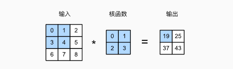
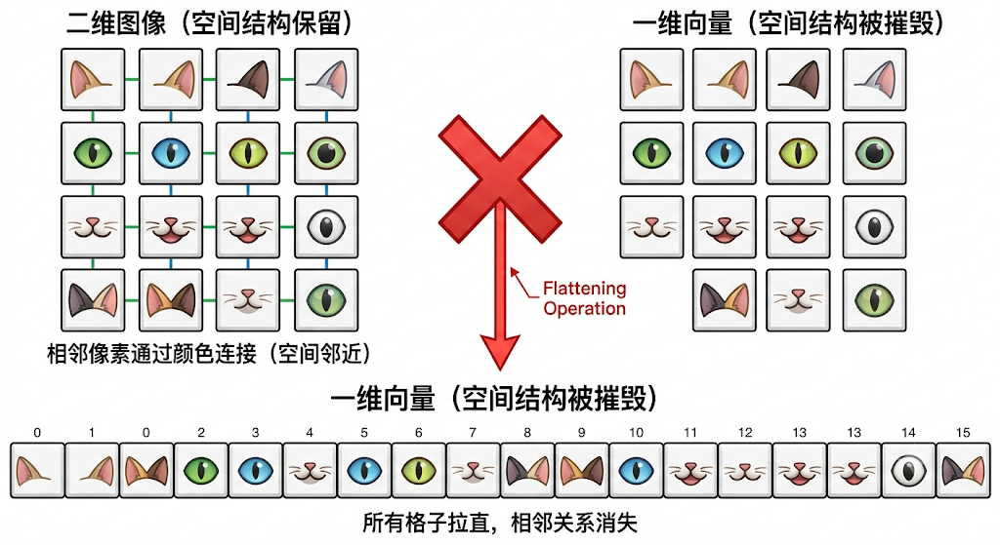
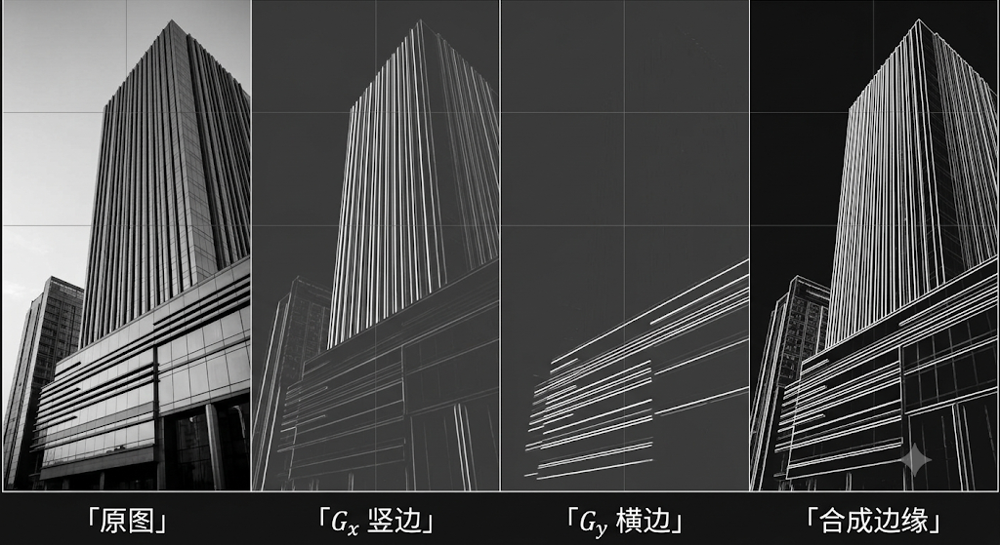
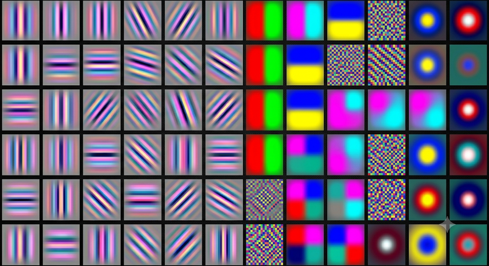
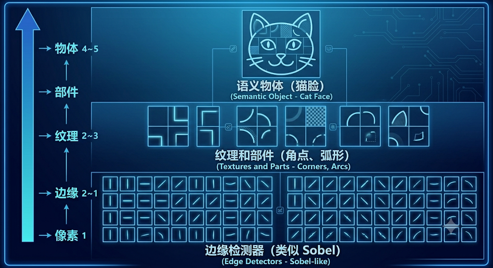
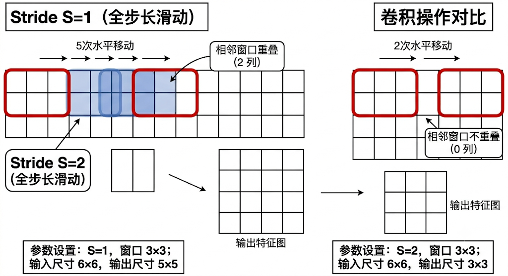
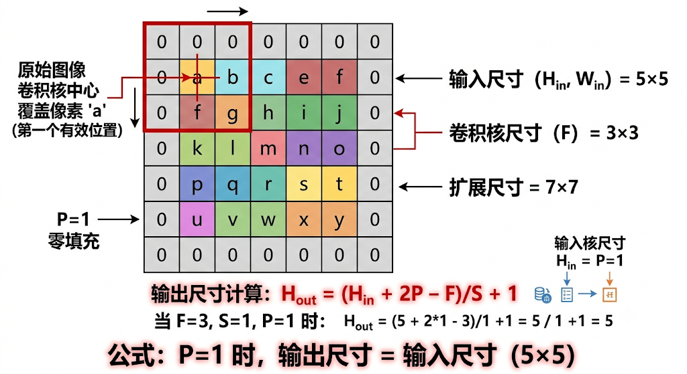
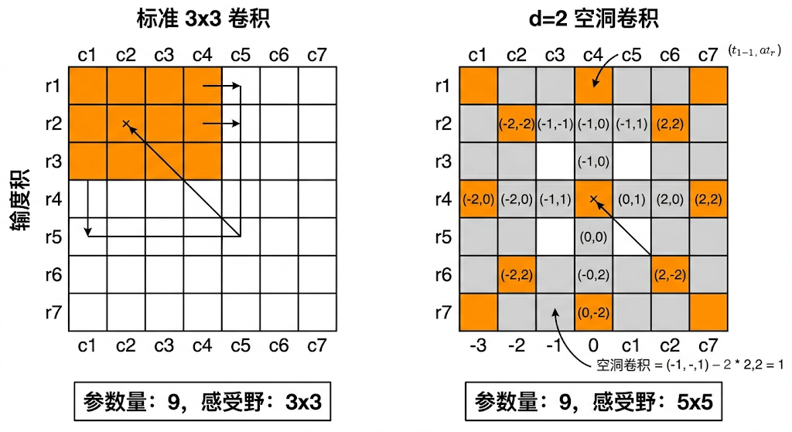

### 五、卷积——让网络"看见"图像

* 上一章我们解剖了全连接网络面对图像时的四个致命缺陷：参数爆炸、空间盲、无平移不变性、无局部性先验。每一个缺陷的根因都指向同一件事——**全连接层把图像当成了一串没有结构、没有顺序、没有空间关系的数字**。它是"瞎"的。

* 这一章要引入的**卷积**，不是某个天才在一夜之间发明的全新数学——它是四个解决方案的自然收敛：**局部连接**（每个神经元只看一小块）、**权重共享**（同一检测器扫遍全图）、**层次化感受野**（堆叠层来覆盖越来越大的区域）、**平移等变性**（输入平移 → 输出同步平移）。这四个设计合在一起，让网络从"记住每个位置的猫"变成"无论猫在哪都能认出它"。

* 这一章不急于介绍具体的 CNN 架构（那是第六章的活），而是把卷积这个操作本身拆开、揉碎、重建——从直觉到数学到组成要素，让读者真正理解为什么"滑动一个窗口"这件事，能彻底改变神经网络处理视觉信息的方式。

---

#### 5.1 从全连接到卷积：四个缺陷的自然解

* 第四章的结论可以用一张因果表来概括。每一个缺陷，都不是"再加一层"或"多喂数据"能解决的——它们是**架构层面的问题**，必须用**架构层面的设计**来回答：

| 缺陷 | 根因 | 架构回答 |
|------|------|---------|
| 参数爆炸（4.1） | 每个输入像素连接每个输出神经元，参数量 $O(n \times m)$ | **权重共享**：所有位置共用同一组参数 |
| 空间盲（4.2） | 将二维图像展平为一维向量，摧毁空间拓扑 | **保持二维结构**：输入和输出都是空间网格 |
| 无平移不变性（4.3） | "检测什么"和"在哪里检测"耦合在同一权重中 | **滑动窗口 + 权重共享**：两者协同——滑动窗口提供位置独立性，权重共享确保检测一致性 |
| 无局部性先验（4.4） | 第一层就将所有像素信息同等混合 | **局部感受野**：每个神经元只连接输入的一小块区域 |

* 这四个答案不是独立的设计选择——它们彼此勾连，互相加强。局部连接自然地导向权重共享（因为每个局部区域的特征检测逻辑是一样的），权重共享自然地赋予平移等变性（因为同一个检测器在位置 A 触发和在位置 B 触发的条件完全相同）。下面逐一展开。

**局部连接：砍掉 99.9991% 的浪费**

* 回到第四章的 $1000 \times 1000$ 图像。全连接第一层：每个输出神经元连接全部 $1{,}000{,}000$ 个输入像素，共 30 亿个参数。CNN 第一层：每个输出神经元只看一个 $3 \times 3$ 的像素块，只连接 9 个输入像素。

* 这不是"少用点参数"的量变优化——这是**结构性的质变**。全连接层的每一个权重 $w_{ij}$ 都在问"输入像素 $j$ 对输出神经元 $i$​ 有多重要"。但根据第四章 4.4 的数据，相距超过 10 个像素的像素之间，RGB 相关性已经降到 0.3 以下——它们几乎互不相关。全连接层为这些几乎不相关的像素对分配了权重、计算了梯度、存储了 Adam 状态，最终训练结束时它们被压缩到接近零。**被浪费的不是计算——是学习信号本身**：那些微弱的、本不该存在的长距离连接，在训练早期产生了大量噪声梯度，干扰了真正重要的局部连接的收敛。

  

* 局部连接的做法：输出位置 $(i, j)$ 的神经元只看输入位置 $(i, j)$ 周围的一个小邻域。这个邻域的大小就是**卷积核大小（kernel size）**——$3 \times 3$、$5 \times 5$、$7 \times 7$ 都是常见选择。$3 \times 3$ 的卷积核只看 9 个输入像素，连接数从 $1{,}000{,}000$ 降到 9——砍掉了 99.9991%。

```
全连接：每个输出神经元连接所有输入
   输入层 (1000×1000)          输出层 (1000×1000)
   ┌─────────────────┐        ┌─────────────────┐
   │ ○ ○ ○ ○ ○ ○ ○ ○ │        │ ● ● ● ● ● ● ● ● │
   │ ○ ○ ○ ○ ○ ○ ○ ○ │  每个  │ ● ● ● ● ● ● ● ● │
   │ ○ ○ ○ ○ ○ ○ ○ ○ │  ──→   │ ● ● ● ● ● ● ● ● │
   │ ○ ○ ○ ○ ○ ○ ○ ○ │  连接  │ ● ● ● ● ● ● ● ● │
   └─────────────────┘        └─────────────────┘
   参数量：1,000,000 × 1,000,000 = 10^12（一万亿，极端情况：输出=输入尺寸）

局部连接：每个输出神经元只看一个小窗口
   输入层 (1000×1000)          输出层 (1000×1000)
   ┌─────────────────┐        ┌─────────────────┐
   │ ○ ○ ○ ○ ○ ○ ○ ○ │        │ ● ● ● ● ● ● ● ● │
   │ ○ ○ ■ ■ ■ ○ ○ ○ │  ──→   │ ● ● ▲ ● ● ● ● ● │  ▲ 只看 ■ 的3×3区域
   │ ○ ○ ■ ■ ■ ○ ○ ○ │        │ ● ● ● ● ● ● ● ● │
   │ ○ ○ ■ ■ ■ ○ ○ ○ │        │ ● ● ● ● ● ● ● ● │
   └─────────────────┘        └─────────────────┘
   参数量：9 × 1,000,000 = 9,000,000（九百万）
```

* 不过，九百万个参数依然不少——而且还有一个更根本的问题没有解决。

**权重共享：同一检测器，扫遍全图**

* 局部连接解决了"不看远处"，但没有解决"每个位置都要重新学"。输出位置 $(2, 3)$ 的神经元和输出位置 $(2, 4)$ 的神经元有各自独立的权重——尽管它们检测的是同一种视觉模式（比如"横边"），只是位置差了一个像素。

* 第四章 4.3 已经说清楚了这个问题：全连接网络需要在数十万个位置上各自学一遍"猫耳朵检测器"。局部连接后，这个问题并没有消失——只是从"数十万个位置各自学"变成了"一百万零九个输入各自学"（每个输出位置有自己的一套 9 个权重）。

* 真正的变革来自一个大胆的约束：**强制所有输出位置共享同一组权重**。

* 具体做法：定义一个 $3 \times 3$ 的**卷积核（kernel）**，包含 9 个可学习的权重 $w_{0,0}, w_{0,1}, \ldots, w_{2,2}$。这个卷积核在图像上滑动——每滑到一个位置，就用**同一组 9 个权重**去计算该位置的输出。无论卷积核在图像的左上角、正中间还是右下角，计算用的都是同一组 $w$。

```
同一组权重 w₀₀, w₀₁, ..., w₂₂ 在图像上滑动：

  位置 (0,0)：              位置 (0,1)：              位置 (1,0)：
  ┌──────────┐              ┌──────────┐              ┌──────────┐
  │■ ■ ■     │              │   ■ ■ ■  │              │          │
  │■ ■ ■     │  用同一组     │   ■ ■ ■  │  用同一组     │■ ■ ■     │
  │■ ■ ■     │  ← w 计算     │   ■ ■ ■  │  ← w 计算     │■ ■ ■     │
  │          │              │          │              │■ ■ ■     │
  └──────────┘              └──────────┘              └──────────┘
```

* 效果是立竿见影的。对于单通道输入，$3 \times 3$ 卷积核：无论输出特征图有多大，总共只有 9 个参数（再加一个偏置 $b$，共 10 个）。与全连接层的 30 亿参数相比——**参数量从 30 亿量级降到个位数**，减少了八个数量级（多通道情况下，$3 \times 3 \times C_{in}$ 个参数依然远小于全连接的 $H \times W \times C_{in} \times H' \times W'$）。

* 更重要的是，权重共享从根本上解决了平移不变性问题。如果猫耳朵检测器的权重是 $w_{0,0}$ 到 $w_{2,2}$，那么无论这只耳朵出现在图像的哪个位置，同一个检测器都会在那里被激活——因为计算逻辑完全一致。**"检测什么"和"在哪里检测"被解耦了**：卷积核定义"检测什么"，滑动位置决定"在哪里检测"。

**保持二维结构：空间不会凭空消失**

* 全连接层的第一步操作是 `flatten()`——把 $1000 \times 1000$​ 的图像拉成 100 万个数字的一维向量。这个操作看似无害（只是数据格式转换），却彻底摧毁了像素之间的空间拓扑关系。

  

* 卷积操作不做 flatten。输入是一个 $H \times W$ 的二维网格（如果是彩色图像，还有 $C$ 个通道），输出也是一个 $H' \times W'$ 的二维网格。输出位置 $(i, j)$ 对应输入位置 $(i, j)$ 附近的局部区域——**空间位置在层层传递中被保留了下来**。

* 这一点的重要性怎么强调都不过分。深度神经网络的一个核心能力是**层次化特征组合**：边缘 → 纹理 → 部件 → 物体。这个层次结构本身就是空间的——一个物体的"眼睛"在"头"的上方，"头"在"身体"的上方。如果输入层就把空间结构摧毁了，后续所有层都不可能重建这些空间关系。

* 卷积通过保持二维网格结构，让网络的每一层都能自然地按空间层次组织特征——低层检测边缘和角点的空间分布，中层将边缘组合成纹理和形状，高层将形状组合成语义部件。这个从"局部到全局"的层次化过程，与视觉世界本身的组合方式完全吻合。

**四方案的协同效应**

* 这四个设计不是四条平行的轨道——它们形成了一个互相增强的正反馈环：

```
  局部连接 ──→ 参数大幅减少 ──→ 可以用更深的网络
     │                              │
     ↓                              ↓
  权重共享 ──→ 平移等变性 ──→ 同一特征只需学一次
     │                              │
     ↓                              ↓
  保持二维 ──→ 保留空间拓扑 ──→ 层次化特征成为可能
```

* 局部连接让每个神经元只学一个小区域的模式。权重共享让"学到的模式"在所有位置上通用。保持二维结构让这些模式的空间关系被保留。三者结合，天然地产生了**平移等变性（translation equivariance）**：如果输入图像向右平移一个像素，输出特征图也向右平移一个像素——"猫"在输入中移动了，"猫耳朵特征"在输出中也同步移动。这与全连接层的"平移即重新计算"构成了根本性的对比。

* 这个四合一的设计方案，就是**卷积层（Convolutional Layer）**。它不是卷积数学的简单应用——它是为视觉信息处理量身定制的架构归纳偏置。

---

#### 5.2 卷积的运算：逐元素相乘，再求和

* 5.1 节从架构层面回答了"为什么需要卷积"。这一节回答"卷积在数学上到底怎么算"——从计算机视觉中最经典的手工算子（Sobel）讲起，让读者先看到一个具体的卷积核长什么样、怎么用、算出什么结果，然后再推广到 CNN 中从数据学到的卷积核。

**互相关运算：卷积的数学内核**

* 深度学习中的"卷积"，数学上准确的名称是**互相关（cross-correlation）**。它的运算规则只有一句话——**逐元素相乘，再求和**。

* 给定一个 $3 \times 3$ 的**卷积核（kernel）** $\mathbf{W}$ 和一个 $3 \times 3$ 的输入窗口 $\mathbf{X}$：

$$
\mathbf{W} = \begin{bmatrix} w_{11} & w_{12} & w_{13} \\ w_{21} & w_{22} & w_{23} \\ w_{31} & w_{32} & w_{33} \end{bmatrix}, \qquad
\mathbf{X} = \begin{bmatrix} x_{11} & x_{12} & x_{13} \\ x_{21} & x_{22} & x_{23} \\ x_{31} & x_{32} & x_{33} \end{bmatrix}
$$

* 互相关运算将两个矩阵**对应位置的元素相乘**，然后把 9 个乘积**全部加起来**，得到一个标量：

$$
\boxed{\text{输出} = w_{11}x_{11} + w_{12}x_{12} + w_{13}x_{13} + w_{21}x_{21} + w_{22}x_{22} + w_{23}x_{23} + w_{31}x_{31} + w_{32}x_{32} + w_{33}x_{33}}
$$

* 用求和符号写就是：

$$
\text{输出} = \sum_{i=1}^{3} \sum_{j=1}^{3} w_{ij} \cdot x_{ij}
$$

* 这就是卷积运算的全部数学。没有积分、没有翻转、没有复变函数——就是**逐元素乘加**。一个卷积核就是一个**模式模板**，互相关运算衡量的是**输入窗口与模板的匹配程度**——值越大，匹配度越高。

> 互相关运算 = 逐元素相乘 + 全部求和 = 模式匹配分数

**从 Sobel 算子讲起：人类设计的第一个卷积核**

* 1968 年，在神经网络还处于寒冬期的年代，计算机视觉研究者 Irwin Sobel 提出了一个划时代的手工算子——**Sobel 边缘检测器**。它的核心就是两个 $3 \times 3$ 的卷积核：

$$
G_x = \begin{bmatrix} -1 & 0 & +1 \\ -2 & 0 & +2 \\ -1 & 0 & +1 \end{bmatrix} \quad \text{（检测竖边）}, \qquad
G_y = \begin{bmatrix} -1 & -2 & -1 \\ 0 & 0 & 0 \\ +1 & +2 & +1 \end{bmatrix} \quad \text{（检测横边）}
$$

* 先看 $G_x$（竖边检测器）。它的"设计逻辑"非常直觉：

  - **左边为负**（$-1, -2, -1$）：如果左边像素很亮（值大），负权重 $\times$ 大值 = 大的负数 $\rightarrow$ 拉低总分。"左边应该是暗的"
  - **右边为正**（$+1, +2, +1$）：如果右边像素很亮（值大），正权重 $\times$ 大值 = 大的正数 $\rightarrow$ 拉高总分。"右边应该是亮的"
  - **中间为零**：中间区域的像素不参与判断，我们只关心"左 vs 右"的对比
  - **中间行权重加倍**（$-2, 0, +2$）：这是离散高斯平滑的近似——靠近中心的那行对结果贡献更大，减少噪声干扰

**用一张具体的图，手算一遍 Sobel**

* 假设有一张 $5 \times 5$ 的灰度图，中间有一道竖边——左半边是暗的（值接近 0），右半边是亮的（值接近 1）：

```
输入图像（5×5，已归一化到 0~1）：

  0.0  0.0  1.0  1.0  1.0
  0.0  0.0  1.0  1.0  1.0
  0.0  0.0  1.0  1.0  1.0     ← 竖边在第二列和第三列之间
  0.0  0.0  1.0  1.0  1.0
  0.0  0.0  1.0  1.0  1.0
```

* 把 $G_x$ 这个 $3 \times 3$ 的"小矩阵"放在图像的**左上角**，盖住一个 $3 \times 3$ 的像素窗口：

```
位置 (0,0)——卷积核盖住输入左上角 3×3 区域：

  输入窗口 X:        卷积核 G_x:
  0.0  0.0  1.0      -1   0  +1
  0.0  0.0  1.0      -2   0  +2
  0.0  0.0  1.0      -1   0  +1
```

* 逐元素相乘再求和——**这就是卷积运算**：

$$
\begin{aligned}
\text{输出}[0,0] &= (-1)\times0.0 + 0\times0.0 + (+1)\times1.0 \\
                &+ (-2)\times0.0 + 0\times0.0 + (+2)\times1.0 \\
                &+ (-1)\times0.0 + 0\times0.0 + (+1)\times1.0 \\[4pt]
                &= 0 + 0 + 1 + 0 + 0 + 2 + 0 + 0 + 1 = 4.0
\end{aligned}
$$

* 输出 $4.0$——一个强烈的信号！说明"这里有一条左暗右亮的竖边"。虽然左上角是图像的角落而非竖边的中心，但 $3 \times 3$ 窗口内恰好覆盖了暗 $\rightarrow$ 亮的过渡，检测器依然触发了。

* 把卷积核**向右滑动一格**，到位置 $(0, 1)$：

```
位置 (0,1)——卷积核右移一格：

  输入窗口 X:        卷积核 G_x:
  0.0  1.0  1.0      -1   0  +1
  0.0  1.0  1.0      -2   0  +2
  0.0  1.0  1.0      -1   0  +1
```

$$
\begin{aligned}
\text{输出}[0,1] &= (-1)\times0.0 + 0\times1.0 + (+1)\times1.0 \\
                &+ (-2)\times0.0 + 0\times1.0 + (+2)\times1.0 \\
                &+ (-1)\times0.0 + 0\times1.0 + (+1)\times1.0 \\[4pt]
                &= 0 + 0 + 1 + 0 + 0 + 2 + 0 + 0 + 1 = 4.0
\end{aligned}
$$

* 输出依然是 $4.0$。因为窗口内依然"左暗右亮"——竖边从第二列开始，右移一格后检测器看到的模式完全一样。这就是**平移等变性**的微观体现：同一模式在相邻位置产生一致的响应。

* 再右移一格，到位置 $(0, 2)$：

```
位置 (0,2)——卷积核完全进入"全亮"区域：

  输入窗口 X:        卷积核 G_x:
  1.0  1.0  1.0      -1   0  +1
  1.0  1.0  1.0      -2   0  +2
  1.0  1.0  1.0      -1   0  +1
```

$$
\begin{aligned}
\text{输出}[0,2] &= (-1)\times1.0 + 0\times1.0 + (+1)\times1.0 \\
                &+ (-2)\times1.0 + 0\times1.0 + (+2)\times1.0 \\
                &+ (-1)\times1.0 + 0\times1.0 + (+1)\times1.0 \\[4pt]
                &= -1 + 0 + 1 -2 + 0 + 2 -1 + 0 + 1 = 0.0
\end{aligned}
$$

* 输出 $0.0$——没有竖边。因为窗口内全是亮像素，正负权重互相抵消。

> **卷积运算的核心直觉**：把卷积核想象成一个"印章"。每到图像的一个位置，就把印章盖上去——印章上的每个数字和图像上被盖住的每个像素值相乘，然后把 9 个乘积加在一起。和越大，说明这个位置的图像模式与印章的匹配度越高。然后印章向右挪一格，再盖一次、再算一次……直到扫完整张图。


*图：一个卷积核在输入矩阵上滑动，每个位置做一次逐元素乘加运算，产生输出矩阵的一个元素。图片来源：Dive into Deep Learning (d2l.ai)。*

**特征图：一张"模式在哪里"的地图**

* 把 Sobel $G_x$ 在 $5 \times 5$ 图像上全部滑一遍（有效位置 $3 \times 3$ 个），得到完整的输出矩阵：

```
输入（5×5）：              输出特征图（3×3）：
 0.0  0.0  1.0  1.0  1.0      4.0  4.0  0.0
 0.0  0.0  1.0  1.0  1.0      4.0  4.0  0.0
 0.0  0.0  1.0  1.0  1.0      4.0  4.0  0.0
 0.0  0.0  1.0  1.0  1.0
 0.0  0.0  1.0  1.0  1.0
```

* 这个 $3 \times 3$ 的输出就是**特征图（feature map）**。它回答了"竖边在哪里"：左边两列的值是 $4.0$（有竖边），右边一列的值是 $0.0$（没有）。特征图的尺寸 $3 \times 3$ 比输入 $5 \times 5$ 小了——因为 $3 \times 3$ 的核不能完整地放在最边缘。5.4 节的**填充（padding）**就是专门解决这个问题的。

* 把 $G_y$（横边检测器）也跑一遍，你会得到第二张特征图——"横边在哪里"。两张特征图合在一起，就是 Sobel 算子对这张图像完整的"边缘分析"。

  

**从手工设计到自动学习：CNN 的卷积核**

* Sobel 的 $G_x$ 和 $G_y$ 是人类花心思设计出来的——$-1, 0, +1$ 的排列蕴含着"边缘 = 相邻像素的差"这个物理直觉。但问题也很明显：Sobel **只能**检测边缘，不能检测角点、纹理、颜色过渡、物体部件……

* 在 CNN 中，**卷积核的权重不再是手工设计的——它们是从数据中学出来的**。训练开始时，64 个卷积核的权重全是随机数。每看一批图片，反向传播就调整一下这些权重，让分类误差变小一点。经过几万次迭代，这些随机数逐渐"长成"了有意义的检测器——竖边的、横边的、斜边的、颜色对立的、纹理的……不是因为有人告诉它们"去找竖边"，而是因为**竖边恰好是对分类猫狗最有用的视觉信息之一**。

* 这个"从随机噪声到有意义的检测器"的演化过程，是深度学习最迷人的部分——5.5 节将用可视化的方式展示 CNN 第一层学到的卷积核长什么样，你会发现它们和 Sobel 惊人地相似。

  

**多卷积核：一张图，多个视角**

* 一张图像包含丰富的视觉信息——竖边、横边、斜边、角点、颜色过渡、纹理图案……单一的 $3 \times 3$ 卷积核只能捕获一种模式。实际 CNN 的第一层通常使用 64 个（或更多）卷积核，每个学会一种不同的基础模式。

* 用 $K$ 个卷积核，输出就是 $K$ 张特征图——每一张是输入图像从某个"视角"看过去的结果：

```
输入图像（3 通道 RGB）
       │
       ├── 卷积核 1（学到：竖边）       ──→ 特征图 1
       ├── 卷积核 2（学到：横边）       ──→ 特征图 2
       ├── 卷积核 3（学到：左上斜边）   ──→ 特征图 3
       ├── 卷积核 4（学到：红-绿对立）  ──→ 特征图 4
       ├── 卷积核 5（学到：蓝-黄对立）  ──→ 特征图 5
       └── ...（共 K 个）
```

* 这些特征图堆叠在一起，形成 $H' \times W' \times K$​ 的输出张量——这就是下一层卷积的输入。深层网络逐层组合这些基础模式：第二层将"竖边"和"横边"组合成"角点"和"T 形交叉"，第三层将角点和交叉组合成"眼睛"、"轮子"等部件……从像素到边缘到部件到物体——这就是 CNN 的**层次化视觉理解**。

  

---

#### 5.3 卷积的数学定义：从直觉到公式

* 5.2 节的逐元素计算让卷积"看得见"，但真正理解它的性质、变化和推广，需要数学定义。这一节从一维开始建立公式，然后推广到二维，最后澄清一个常见的术语混淆。

**一维卷积**

* 一维卷积是理解卷积数学的最小单元。给定一个输入序列 $x[0], x[1], \ldots, x[N-1]$ 和一个卷积核 $w[0], w[1], \ldots, w[K-1]$（$K$ 为核大小，通常为奇数），一维卷积在位置 $i$ 的输出为：
$$
y[i] = \sum_{k=0}^{K-1} w[k] \cdot x[i + k]
$$
* 这个公式的含义：把卷积核"盖"在以 $x[i]$ 为起点的输入段上，逐元素相乘再求和。核的大小 $K$ 决定了"视野"的宽度——$K=3$ 意味着每个输出位置整合了连续的 3 个输入值。

* 一维卷积的典型应用是**时间序列**和**文本**。在音频处理中，$x$ 是声波采样值，一个学到的卷积核可能变成音调检测器。在文本 CNN 中，$x$ 是词向量序列，卷积核在连续的几个词上滑动，检测局部的语义模式（如"not good"这种二元词组的情感信号）。

**二维卷积**

* 推广到二维：输入是一个 $H \times W$ 的网格 $x[i, j]$，卷积核是一个 $K_h \times K_w$ 的权重矩阵 $w[p, q]$。二维卷积在位置 $(i, j)$ 的输出为：
$$
y[i, j] = \sum_{p=0}^{K_h-1} \sum_{q=0}^{K_w-1} w[p, q] \cdot x[i + p,\, j + q]
$$
* 这个双重求和就是 5.2 节逐元素计算的公式化：对卷积核覆盖的 $K_h \times K_w$ 区域内每一对 $(p, q)$，取权重 $w[p, q]$ 乘以对应位置的输入值 $x[i+p, j+q]$，全部加起来。

* 加上偏置 $b$（每个卷积核一个标量偏置），完整的卷积层输出为：
$$
y[i, j] = \left(\sum_{p=0}^{K_h-1} \sum_{q=0}^{K_w-1} w[p, q] \cdot x[i + p,\, j + q]\right) + b
$$
* 绝大多数 CNN 使用正方形卷积核（$K_h = K_w = K$），最常见的是 $3 \times 3$（VGG 风格）和 $5 \times 5$、$7 \times 7$（大感受野需求）。

**多通道卷积**

* 5.2 节的例子是单通道灰度图。彩色图像有 RGB 三个通道——输入是一个 $H \times W \times C_{in}$ 的张量，其中 $C_{in}$ 是输入通道数。卷积核相应地扩展为 $K \times K \times C_{in}$ 的三维权重张量——**一个卷积核在空间上是 $K \times K$，但深度上覆盖所有输入通道**。

* 多通道二维卷积的输出（在位置 $(i, j)$，对于第 $k$ 个卷积核）：
$$
y_k[i, j] = \sum_{c=0}^{C_{in}-1} \sum_{p=0}^{K-1} \sum_{q=0}^{K-1} w_k[p, q, c] \cdot x[i + p,\, j + q,\, c] + b_k
$$
* 注意：每个卷积核跨所有输入通道求和后，输出一个**单通道**的特征图。$C_{out}$ 个卷积核产生 $C_{out}$ 个输出通道。因此，一个卷积层的完整参数形状为 $K \times K \times C_{in} \times C_{out}$——例如，64 个 $3 \times 3$ 卷积核处理 3 通道 RGB 输入，参数量为 $3 \times 3 \times 3 \times 64 = 1{,}728$ 个权重 + 64 个偏置。

* 这个设计的直觉：每个卷积核在**所有输入通道上同时操作**，将来自不同通道的信息在当前位置融合。第一层卷积将 RGB 三通道的局部模式融合为 64 种"跨通道的局部模式"输出——不是简单的"RGB 三张图各自处理"，而是"红绿蓝如何在局部区域组合成一个统一模式"。

**互相关 vs 卷积：深度学习中的"卷积"到底是什么**

* 数学中的标准二维卷积定义是：
$$
(f * g)[i, j] = \sum_{p} \sum_{q} f[p, q] \cdot g[i - p,\, j - q]
$$
* 注意索引的差异：$g[i - p, j - q]$ 而非 $g[i + p, j + q]$。这意味着在数学卷积中，卷积核先被**水平和垂直翻转**（旋转 $180^\circ$），然后再做滑动点积。但深度学习中使用的操作是：
$$
y[i, j] = \sum_{p} \sum_{q} w[p, q] \cdot x[i + p,\, j + q]
$$
* 没有翻转——这就是**互相关（cross-correlation）**，而非严格数学意义上的卷积。

* 那为什么所有人都叫它"卷积"？两个原因。第一，翻转与否对学习没有影响——卷积核的权重是从随机初始化开始学的，如果任务需要翻转版本，网络会通过训练自然学到翻转后的权重。第二，历史惯性——深度学习社区从 LeNet（1989）开始就把互相关叫卷积，这个约定已经深入骨髓。

* 本书遵循社区约定，继续称其为"卷积"。但在需要精确数学讨论时（如信号处理中的卷积定理、FFT 加速），需要记住这个区别。

**卷积的向量化视角**

* 把 $K \times K \times C_{in}$ 的卷积核拉成一个长度为 $K^2 \cdot C_{in}$ 的向量 $\mathbf{w}$，把 $K \times K \times C_{in}$ 的输入窗口拉成同样长度的向量 $\mathbf{x}_{ij}$，则卷积输出就是一个简单的点积：
$$
y[i, j] = \mathbf{w}^T \mathbf{x}_{ij} + b
$$
* 这个视角揭示了一个重要事实：**卷积层在每一个空间位置，本质上是执行一个局部全连接**——一个覆盖 $K \times K \times C_{in}$ 个输入的线性函数，后面跟着非线性激活。不同位置共享同一个 $\mathbf{w}$，这就是卷积与全连接的全部区别。

* 换一个角度看：全连接层在位置 $(i, j)$ 执行 $\mathbf{w}_{ij}^T \mathbf{x} + b_{ij}$——每个位置有自己独立的权重向量 $\mathbf{w}_{ij}$；卷积层在位置 $(i, j)$ 执行 $\mathbf{w}^T \mathbf{x}_{ij} + b$——所有位置共享同一个 $\mathbf{w}$，但每个位置的输入向量 $\mathbf{x}_{ij}$ 不同。全连接是"同一碗水端给所有人，每人用自己的杯子喝"；卷积是"同一个杯子在不同位置舀一勺水"。整个第五章讲的所有内容——从四个缺陷到架构回答到参数分析——本质上就是在论证：**对于视觉数据，同一个杯子（共享的检测器）比每人一个杯子（独立的检测器）更合理、更高效、更接近视觉世界本身的规律。**

* 这个视角也解释了为什么 CNN 的理论分析可以部分地借用全连接网络的结果——卷积层是"加了空间共享约束的全连接层"，而非一个完全不同的数学对象。同时，它也为第六章的架构演进埋下了伏笔：ResNet 的残差连接、Inception 的多尺度并联、MobileNet 的深度可分离——这些设计本质上都是在"共享什么、解耦什么、在哪里增加非线性"这三个维度上做文章。

---

#### 5.4 卷积层的组成要素：控制行为的那几个参数

* 定义了一个卷积核的数学形式之后，还有四个参数控制卷积层的行为：核大小决定视野，步长决定移动密度，填充决定边界处理，通道数决定表达能力。这四个参数的选择不是随意的——它们之间有深刻的交互关系，理解这些关系是设计 CNN 架构的基本功。还有一个贯穿所有要素的参数——**偏置 $b$**：每个卷积核有一个标量偏置，与核权重共享跨所有空间位置（和权重共享一样的原则），在功能上充当阈值——决定在没有强输入信号时特征检测器的基线激活水平。

**核大小（Kernel Size）：视野的半径**

* 核大小 $K$ 决定了每个输出位置能看到多大的输入区域。$3 \times 3$ 是最常见的选择——它是最小的能捕获"中心 vs 邻域"关系的二维核（$2 \times 2$ 没有中心，$1 \times 1$ 没有空间关系）。

* 大核 vs 小核的权衡：

| | 小核（$3 \times 3$） | 大核（$7 \times 7$, $11 \times 11$） |
|---|---|---|
| 参数 | 少 | 多 |
| 感受野 | 小（需要多层堆叠） | 大（单层就看得远） |
| 细节捕获 | 好（精细的局部模式） | 差（对小特征不敏感） |
| 计算量 | 低 | 高（$K^2$ 增长） |
| 非线性 | 更多（更多层 = 更多激活函数） | 更少 |

* VGG（2014）的一个关键洞察：**两个堆叠的 $3 \times 3$ 卷积，感受野等价于一个 $5 \times 5$ 卷积，但参数更少（单通道下 $2 \times 9 = 18$ vs $25$），非线性更多（两个 ReLU vs 一个）**。在多通道场景下精确的参数比取决于输入/输出/中间通道数的配置，但"更少参数 + 更多非线性"的定性结论始终成立。这直接导致了现代 CNN 几乎清一色地使用 $3 \times 3$ 卷积核堆叠，而非早期 AlexNet 的 $11 \times 11$ 大核。

* 具体的等价关系：堆叠 $n$ 个 $3 \times 3$ 卷积（步长 1，无填充），顶层神经元的有效感受野大小是 $(2n+1) \times (2n+1)$。2 层 → $5 \times 5$，3 层 → $7 \times 7$，4 层 → $9 \times 9$——用深度换取视野，每一层还多了一次非线性变换。

**步长（Stride）：滑动的步伐**

* 步长 $S$ 控制卷积核每次移动多少像素。$S=1$ 意味着卷积核逐像素滑动（相邻输出位置对应的输入窗口重叠了 $K-1$ 列/行），$S=2$​ 意味着每隔一个像素滑动一次（输出尺寸减半）。

  

```
S=1（逐像素滑动）：        S=2（隔一个像素滑动）：

输入：■ ■ ■ ■ ■ ■          输入：■ ■ ■ ■ ■ ■
      ↓ ↓ ↓ ↓                     ↓     ↓
卷积核滑动 5 次              卷积核滑动 2 次
```

* 步长 $S$ 与输出尺寸的关系（无填充）：
$$
H_{out} = \left\lfloor \frac{H_{in} - K}{S} \right\rfloor + 1, \quad W_{out} = \left\lfloor \frac{W_{in} - K}{S} \right\rfloor + 1
$$
* $S=1$ 保持空间分辨率（输出尺寸 ≈ 输入尺寸），$S=2$ 将空间分辨率减半。步长大于 1 是 CNN 中**下采样（downsampling）**的一种方式——逐步减小特征图的空间尺寸，同时增大感受野。$S=2$ 的效果类似于池化层（第七章），但它是通过跳过位置实现的，而非池化的聚合操作。

* 步长很少大于 2——$S=3$ 或 $S=4$ 会跳过太多输入信息，且输出尺寸计算困难（需要填充配合）。

**填充（Padding）：边界上的像素也需要被看见**

* 没有填充时，$3 \times 3$ 的卷积核只能放在距离边界至少 1 个像素的位置——边界像素比内部像素被"看"到的次数更少。$5 \times 5$ 的输入用 $3 \times 3$ 的卷积核，输出只有 $3 \times 3$​——输入的四条边各"损失"了一排像素。

  

* **零填充（zero padding）**在输入的四边外侧各补 $P$ 圈零值像素，让卷积核可以"出界"到填充区域：

```
输入（5×5）加上 P=1 的零填充变成（7×7）：

  0  0  0  0  0  0  0
  0  a  b  c  d  e  0
  0  f  g  h  i  j  0
  0  k  l  m  n  o  0
  0  p  q  r  s  t  0
  0  u  v  w  x  y  0
  0  0  0  0  0  0  0
```

* 两种最常见的填充模式：

  - **valid（无填充）**：$P=0$，输出尺寸小于输入尺寸：$H_{out} = H_{in} - K + 1$。
  - **same（保持尺寸）**：选择 $P$ 使得 $H_{out} = H_{in}$（步长 $S=1$ 时）。对于 $K$ 为奇数，$P = \lfloor K/2 \rfloor$——$3 \times 3$ 卷积需要 $P=1$，$5 \times 5$ 需要 $P=2$。

* Same 填充是现代 CNN 的默认选择——它让特征图尺寸在网络中保持稳定，设计师不需要在每个卷积层后重新计算尺寸。对于 $3 \times 3$ 卷积，$P=1$ 是"刚好够"的填充——核的中心可以覆盖到输入的最边缘像素。

* 带填充的输出尺寸公式：
$$
H_{out} = \left\lfloor \frac{H_{in} + 2P - K}{S} \right\rfloor + 1
$$
**通道数（Channels）：信息的宽度**

* 输入通道数 $C_{in}$ 由上一层决定（第一层是图像的 RGB=3 或灰度=1）。输出通道数 $C_{out}$ 是一个**可自由选择的设计参数**，等于这一层使用的卷积核数量。

* 通道数的设计遵循一个经验性的规律：**空间尺寸减半，通道数翻倍**。这个规律在 VGG 和 ResNet 中反复出现：

```
输入：224 × 224 × 3
  ↓ Conv1: 64 个 3×3 核
特征图：224 × 224 × 64       ← 空间不变，通道增 20 倍
  ↓ Pooling / Stride=2
特征图：112 × 112 × 64       ← 空间减半
  ↓ Conv2: 128 个 3×3 核
特征图：112 × 112 × 128      ← 空间不变，通道翻倍
  ↓ Pooling / Stride=2
特征图：56 × 56 × 128        ← 空间减半
  ↓ Conv3: 256 个 3×3 核
特征图：56 × 56 × 256        ← 空间不变，通道翻倍
  ↓ ...
```

* 为什么这个模式有效？空间尺寸减半意味着每个特征图包含的"位置信息"减少——但语义信息不应该减少。增加通道数补偿了空间信息的损失：网络将粗粒度的空间信息重新编码为更丰富的跨通道表示。到网络的深层（如 ResNet-50 的最后几层，$7 \times 7 \times 2048$），特征图的空间尺寸已经非常小但通道数很大——每个空间位置上的 2048 维向量，编码了该区域的高层语义描述。

**$1 \times 1$ 卷积：最被低估的操作**

* $1 \times 1$ 卷积看起来像一个无操作——它只看一个像素，没有空间上下文。但它可能是 CNN 中功能密度最高的操作：

  1. **跨通道信息融合**：$1 \times 1$ 卷积在每一个空间位置独立执行——将 $C_{in}$ 个输入通道的值做一次线性组合，输出 $C_{out}$ 个通道。它的作用等价于在每个空间位置放一个全连接层（参数共享跨所有空间位置）。

  2. **升维和降维**：当 $C_{out} < C_{in}$ 时，$1 \times 1$ 卷积压缩通道数（降维），减少后续大核卷积的计算量。当 $C_{out} > C_{in}$ 时，它扩展通道数（升维），给后续层提供更丰富的表示空间。Inception 和 ResNet 中大量使用 $1 \times 1$ 卷积做降维，实现"先压缩、再处理、再扩展"的高效模式。

  3. **增加非线性**：$1 \times 1$ 卷积后跟 ReLU，等价于在每个空间位置增加一次非线性变换——不改变空间尺寸，不改变感受野，只增加网络的表达能力。

* $1 \times 1$ 卷积的参数量为 $C_{in} \times C_{out}$（加偏置则为 $C_{in} \times C_{out} + C_{out}$）。当用于降维时（如 ResNet 的 bottleneck：$1 \times 1$ 卷积将 256 通道降为 64，后续 $3 \times 3$ 卷积在 64 通道上运算），计算量从 $256 \times 256 \times 9 = 589{,}824$ 降为 $64 \times 64 \times 9 = 36{,}864$——降低了约 16 倍。

---

#### 5.5 从手工特征到自动学习的特征：CNN 的第一层揭示了一切

* 核大小、步长、填充、通道数——这四个参数定义了一个卷积层"能学什么"和"以什么粒度学"。但最终决定性的问题是：这些由随机数初始化的卷积核，经过训练后到底变成了什么？它们真的学到了我们期望的视觉模式吗？

* 5.2 节已经展示了 Sobel 算子——一个手工设计的 $3 \times 3$ 卷积核，用 $-1, 0, +1$ 的排列来检测边缘。Sobel 是计算机视觉中**手工特征设计**时代的缩影。在那个时代，研究者耗费数年心血设计各种滤波器：Sobel、Canny、Gabor、SIFT、HOG……每一个都在试图回答"什么视觉模式对识别物体最重要"。

* CNN 没有手工设计这些滤波器——它让数据自己回答这个问题。第一层卷积的 64 个卷积核从随机初始化开始，通过反向传播逐渐"发现"什么模式对分类最有用。5.2 节末尾的那张图已经预告了结果——**训练结束后的第一层卷积核，和人类花了二十年设计的手工滤波器，看起来惊人地相似。**

**手工设计的另一座高峰：Gabor 滤波器**

* Gabor 滤波器（由 Dennis Gabor 于 1946 年提出全息术理论，后由 Daugman 等人于 1980 年代推广为计算机视觉中的 Gabor 滤波器）则更进一步——它用正弦波调制高斯函数，产生各种方向、各种频率、各种相位的纹理检测器。其二维形式为：
$$
G(x, y) = \exp\left(-\frac{x'^2 + \gamma^2 y'^2}{2\sigma^2}\right) \cdot \cos\left(2\pi f x' + \phi\right)
$$
* 其中 $x' = x\cos\theta + y\sin\theta$，$y' = -x\sin\theta + y\cos\theta$（将滤波器旋转到方向 $\theta$），$f$ 控制条纹频率，$\sigma$ 控制高斯包络宽度，$\gamma$ 控制椭圆率。一个典型的 Gabor 滤波器组可能包含 5 个频率 × 8 个方向 = 40 个滤波器——每个捕获一种特定方向-频率组合的纹理模式。在 CNN 成熟之前，Gabor 滤波器组是纹理识别和人脸识别的主流方法。

**自动学习的卷积核：数据说了算**

* 现在，取一个训练好的 CNN（比如在 ImageNet 上训练的 AlexNet 或 VGG），把第一层卷积核可视化出来。下图是 AlexNet 第一层 96 个 $11 \times 11 \times 3$ 卷积核的可视化——每个小方块是一个卷积核的三个 RGB 通道权重渲染结果：

```
手工设计的滤波器：              CNN 第一层学到的滤波器（典型样本）：

Sobel G_x:                   核 1: 带方向的边缘（左暗右亮）
-1   0  +1                   核 2: 带方向的边缘（上暗下亮）
-2   0  +2                   核 3: 45° 斜边
-1   0  +1                   核 4: 颜色对立检测器（红-绿）
                             核 5: 颜色对立检测器（蓝-黄）
Gabor（45°, 高频）:           核 6: 高频纹理（网格状）
[类似正弦波纹的权重图]         核 7: 低频模糊梯度
                             核 8: 中心-环绕（亮中心暗边框）
                             ... 所有 64 个都是类似的基础模式
```

* 这个发现是深度学习最具说服力的证据之一：**网络从头学到的第一层特征，和人类花了二十年手工设计的滤波器属于同一类东西——有方向的边缘检测器、颜色对立检测器、中心-环绕检测器。** 区别只有一个：CNN 的滤波器是通过反复看 120 万张图片、每次根据分类错误调整权重——自动"涌现"出来的，没有人类编码任何视觉知识。

* 更深层的意义是：如果第一层学到的就是人类能设计的最优基础特征，那第二层、第三层、第四层学到的是什么？它们组合这些基础特征，构建了人类**无法手工设计**的高阶模式——人类能描述"边缘"和"角点"，但无法描述"第 47 个卷积核在第 15 层第 3 通道的响应模式"。CNN 的价值不仅在于"自动化"，更在于**它学到的特征层次超出了人类的特征工程能力**。

**为什么第一层总是边缘和颜色？**

* 这不是巧合。任何自然图像的局部 $3 \times 3$（或 $5 \times 5$）区域，最有信息量的结构就是**相邻像素之间的梯度**——亮度的空间变化。边缘是最简单、最普遍、信息密度最高的局部视觉模式。

* 从信息论的角度看：一个 $3 \times 3$ 的灰度图像块有 9 个像素值——9 维空间中的一个点。但自然图像的 $3 \times 3$ 块并非均匀分布在这 9 维空间中——它们几乎全部集中在某些低维流形上，这些流形对应着"边缘"、"角点"、"平坦区域"、"斑点"等结构。CNN 的第一层卷积核，本质上是在**学习自然图像块的 PCA 基**——找到最能区分不同图像块的那些方向。

* 这也解释了为什么在不同数据集上（ImageNet 的 1000 类 vs CIFAR-10 的 10 类 vs 医学图像），第一层卷积核学到的东西惊人地相似——因为自然图像的局部统计结构是普适的，与分类任务无关。

**从手工特征到自动特征：哲学层面的转变**

* 传统 CV 流水线：原始图像 → 手工特征提取（SIFT/HOG） → 分类器（SVM/决策树）。特征提取和分类是两个独立的阶段——特征工程师设计滤波器，机器学习专家训练分类器。

* CNN 流水线：原始图像 → 所有层都是可学习的。特征提取和分类不再是两个阶段——它们是同一个端到端优化过程的产物。**损失函数直接作用在最顶层的分类输出，梯度穿透整个网络，同时调整第一层的边缘检测器和最后一层的分类边界。**

* 这个"端到端学习"的哲学影响深远。当一个系统是端到端可微的——即输出对每个参数的梯度都能被计算——人类就不再需要手工设计任何中间表示。数据 + 损失函数 + 梯度下降自动完成了从原始像素到语义标签的全部映射学习。卷积只是给这个学习系统提供了一个**合理的起点**（局部性、平移等变性），而非"告诉它该学什么"。

---

#### 5.6 感受野：从局部看到全局的阶梯

* 5.1 节的局部连接解决了参数爆炸，但它引入了一个新问题：**每个神经元只管自己的"一亩三分地"，怎么理解需要全局视野的东西？** 一只猫可能占据图像的 60% 面积——一个只看 $3 \times 3$ 像素的神经元，连猫的一根胡须都看不全。

* 答案在**深度**。单个神经元的视野确实很小，但当卷积层被堆叠起来时，越深层的神经元"看到"的输入区域越大——这就是**感受野（receptive field）**。

**什么是感受野？**

* 一个神经元的感受野，是**输入图像中能影响该神经元输出的所有像素的集合**。对于第一层卷积的一个神经元（如 $3 \times 3$ 卷积核），它的感受野就是那 $3 \times 3$ 的 9 个输入像素。对于第二层卷积的一个神经元——它接收的是第一层输出的 $3 \times 3$ 区域，而第一层的每个值又来自输入的 $3 \times 3$ 区域——它的有效感受野是输入中的 $5 \times 5$​ 区域。

  

```
输入层    第1层特征图    第2层特征图
  ○ ○ ○ ○ ○
  ○ ● ● ● ○  ← 第1层某个3×3窗口
  ○ ● ● ● ○      ↓
  ○ ● ● ● ○     对应输入中的5×5区域
  ○ ○ ○ ○ ○     （第2层神经元的感受野）
```

* 更精确的计算：堆叠 $L$ 个 $K \times K$ 卷积层（步长 1，无填充），第 $L$ 层神经元的理论感受野大小为：
$$
RF_L = RF_{L-1} + (K - 1) = L \times (K - 1) + 1
$$

* 对于 $3 \times 3$ 卷积核：1 层 → $3 \times 3$，2 层 → $5 \times 5$，3 层 → $7 \times 7$，10 层 → $21 \times 21$。对于 $224 \times 224$ 的 ImageNet 输入，需要约 112 个 $3 \times 3$ 卷积层才能让最深层神经元看到整张图——这是不切实际的。

* 实践中，CNN 用三种机制加速感受野的扩张：**步长大于 1 的卷积**（每次下采样，感受野跃升一倍）、**池化层**（$2 \times 2$ 池化直接让感受野翻倍）、和**空洞卷积**（不增加参数就让感受野按指数增长）。

**步长和池化对感受野的放大效应**

* 步长 $S > 1$ 或 $2 \times 2$ 最大池化，将空间分辨率减半，同时使后续层每个神经元的感受野（相对于输入）翻倍。一个典型的 CNN 使用 4-5 次空间下采样，感受野迅速覆盖全图：

```
层       操作            输出尺寸      感受野（相对于输入）
输入     —               224×224      1×1
Conv1    3×3, S=1        224×224      3×3
Pool1    2×2, S=2        112×112      4×4
Conv2    3×3, S=1        112×112      8×8
Pool2    2×2, S=2         56×56      10×10
Conv3    3×3, S=1         56×56      18×18
Pool3    2×2, S=2         28×28      22×22
Conv4    3×3, S=1         28×28      38×38
Pool4    2×2, S=2         14×14      46×46
Conv5    3×3, S=1         14×14      78×78
Pool5    2×2, S=2          7×7       94×94
```

* 到最后一层（$7 \times 7$），每个神经元已经能"看到"输入图像中近 $100 \times 100$ 的区域——够覆盖一只中等大小的猫了。不过，理论感受野（每个位置贡献均等）和**有效感受野（effective receptive field，ERF）**之间存在一个关键的差距。

* Luo 等人（2016）的研究揭示：有效感受野并不是一个均匀的矩形——它的权重在中心像素处最大，向四周近似以高斯分布衰减（具体形状受初始化方式和训练阶段影响）。原因在梯度的累积路径上：反向传播时，梯度从深层传到浅层需要逐层乘以卷积核权重。中心像素到深层神经元的路径最短（经过 $L$ 步直达），而边缘像素的路径更长、累积的权重乘积更小。经过 $L$ 层后，中心像素的影响权重远大于边缘像素——**理论感受野是一个 $94 \times 94$ 的矩形，但有效感受野可能只相当于一个 $\sigma \approx 94 / \sqrt{L}$ 的高斯核的 $3\sigma$ 范围**。

* 这个性质对架构设计有直接且重要的启示。第一：**不要为了追求大感受野而无节制地堆叠卷积层**——虽然理论 RF 线性增长，但有效 RF 的增长速度远慢于理论值（约正比于 $\sqrt{L}$），堆太多浅层卷积可能事倍功半。第二：**边界像素的"话语权"很弱**——即使理论感受野覆盖到了，离中心远的输入像素对输出的实际影响也微乎其微。这意味着深层特征的"视角"天然地集中在输入图像的局部区域，因此必须在适当位置使用步长卷积或池化来强制扩大有效感受野。第三：**空洞卷积和池化的放大效应不只是"让 RF 变大"，更是让有效 RF 分布更均匀**——跳过了中间的衰减累积，让更多像素能以较短路径影响输出。

**空洞卷积（Dilated Convolution）：不增加参数就能看到更远**

* 标准 $3 \times 3$ 卷积的 9 个权重覆盖输入中的一个连续 $3 \times 3$ 块。空洞卷积在权重之间**插入空洞（零值）**，让同样的 9 个权重覆盖一个更大的、稀疏的输入区域。

* 空洞率（dilation rate）$d$ 控制空洞的大小。$d=1$ 就是标准卷积（无空洞）。$d=2$ 意味着在每两个权重元素之间插入一个零——$3 \times 3$ 的 9 个权重覆盖了输入中一个 $5 \times 5$ 的区域（只有 9 个位置被采样，其余位置跳过）：

```
标准卷积（d=1）：           空洞卷积（d=2）：
输入网格中卷积核覆盖：      输入网格中卷积核覆盖：
  ■ ■ ■                      ■ ○ ■ ○ ■
  ■ ■ ■  9个连续位置          ○ ○ ○ ○ ○
  ■ ■ ■                      ■ ○ ■ ○ ■  9个位置，间隔为2
                              ○ ○ ○ ○ ○
                              ■ ○ ■ ○ ■
```

* 空洞卷积的魔力在于——**参数不变（依然 9 个权重），感受野却从 $3 \times 3$ 跃升为 $5 \times 5$**。堆叠不同空洞率的卷积层，可以让感受野指数增长：

```
层      空洞率    卷积核覆盖的输入区域    该层神经元感受野
Conv1    d=1          3×3                    3×3
Conv2    d=2          5×5                    7×7
Conv3    d=4          9×9                   15×15
Conv4    d=8         17×17                   31×31
```

* 四层空洞卷积（共 36 个参数）就让感受野达到 $31 \times 31$——标准卷积需要 15 层才能做到。这使得空洞卷积在需要大感受野但不想增加参数或深度的场景中极其有用：语义分割（需要为每个像素做分类，同时看到大的上下文）、语音生成（WaveNet，堆叠空洞因果卷积来覆盖长时序依赖）。

* 但空洞卷积也有代价——网格效应（gridding effect）。空洞采样跳过了大量像素（以 $d=4$ 为例，只采样了 $9 \times 9$ 区域中的 9/81 = 11% 的像素），跳过的那些像素对特征图没有贡献。对于连续细小的物体（如远处的人、细电线），空洞卷积可能完全错过关键的结构。无怪乎现代语义分割网络（如 DeepLabV3+）采用多种空洞率的并联分支来缓解这一问题。

**感受野设计的两个原则**

* 第一：**感受野应该至少覆盖输入图像中最大相关结构的尺寸。** 如果数据集中最重要的物体平均占据 50% 的图像面积，顶层神经元的感受野应至少达到输入尺寸的一半。感受野不够大 = 网络被迫通过 FC 层做全局推理（这正是我们想避免的）、或者做出"盲人摸象"式的分类——看到尾巴说是绳子，看到腿说是柱子。

* 第二：**多尺度信息至关重要。** 真实图像中，同一类物体以不同大小出现——远处的猫只有 $20 \times 20$ 像素，近处的猫有 $200 \times 200$ 像素。一个固定感受野的网络，对某一大小的物体最优，对其他大小则不。现代架构通过多尺度设计解决这一问题——Inception 的并行多核大小、FPN（特征金字塔网络）的自上而下路径、以及空洞空间金字塔池化（ASPP）的多空洞率并联。

---

### 总结

* 这一章从上一章的四个缺陷出发，展示了卷积如何通过四个相互加强的设计——**局部连接**、**权重共享**、**保持二维结构**、**隐式平移等变性**——将全连接网络的 $O(n \times m)$ 参数复杂度降为 $O(K^2 \cdot C_{in} \cdot C_{out})$，同时将**"检测什么"与"在哪里检测"解耦**、将**空间拓扑保留在层层传递中**、将**局部性从被浪费的参数转变为架构的基础**。

* 具体来说：

1. **5.1 缺陷驱动设计**：参数爆炸 → 局部连接和权重共享（参数量从 30 亿量级降到数千量级）；空间盲 → 保持二维网格结构；无平移不变性 → 滑动窗口 + 权重共享 → 平移等变性；无局部性先验 → 每个神经元只连接局部邻域。

2. **5.2 卷积运算**：从互相关运算的数学定义（逐元素乘加）出发，以 Sobel 算子为经典入门案例——手算 $G_x$ 在 $5 \times 5$ 图像上三个位置的逐元素乘加过程，引出特征图和模式匹配的直觉。"印章"类比：卷积核 = 印章，滑动 = 盖印，乘加 = 匹配打分。拓展到多卷积核：$K$ 个卷积核 $\rightarrow$ $K$ 张特征图，从多视角分解图像信息。

3. **5.3 数学定义**：从一维卷积推广到二维、再到多通道卷积的三重求和。澄清了"互相关 vs 卷积"的术语差异（深度学习用的是互相关，但社区约定称卷积）。给出了卷积的向量化视角——每个位置的卷积是一个局部点积 $\mathbf{w}^T \mathbf{x}_{ij} + b$。

4. **5.4 组成要素**：核大小（$K \times K$——视野半径，$3 \times 3$ 是当代标准）、步长（$S$——控制下采样和输出尺寸）、填充（$P$——same vs valid，边界处理）、通道数（$C_{out}$——空间减半/通道翻倍的经验规律）、$1 \times 1$ 卷积（跨通道融合 + 升降维 + 增加非线性的多功能操作）。

5. **5.5 手工到自动**：对比了 Sobel/Gabor 等手工滤波器与 CNN 第一层学到的滤波器——它们在结构上几乎一致（有方向的边缘和颜色对立检测器），区别在于 CNN 的滤波器是从数据中自动涌现的。更深层的意义：CNN 不仅是自动化，更是学到了超出人类设计能力的高阶特征层次。

6. **5.6 感受野**：每个神经元只能看到输入的一小部分→深度堆叠让感受野线性增长→步长和池化让感受野翻倍→空洞卷积在参数不变的情况下让感受野指数增长。感受野的两个设计原则：覆盖最大相关结构、多尺度信息不可或缺。

* 这一章讲的是卷积这个操作本身的原理和组成。下一章将把这些组件组装成完整的架构——从 1998 年的 LeNet-5（7 层，手写数字识别）到 2015 年的 ResNet-152（152 层，ImageNet 冠军），看人类如何在三十年间逐步学会"堆得更深、连得更巧、算得更省"。
